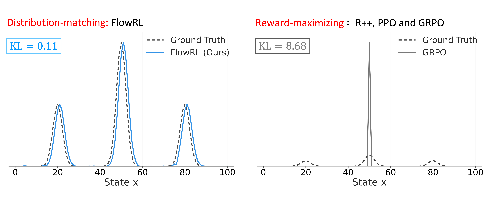

<h1 align="center" style="color:#1976D2; font-size:42px; font-weight:bold; margin-bottom:0;">
  FlowRL
</h1>

<p align="center" style="color:#42A5F5; font-size:16px; margin-top:0;">
  Matching Reward Distributions via Flow Balance
</p>
<p align="center" style="color:#42A5F5; font-size:15px; margin-top:4px;">
  <a href="https://arxiv.org/abs/2509.15207" target="_blank">📄 arXiv Paper</a> |
  <a href="https://huggingface.co/papers/2509.15207" target="_blank">🤗 #1 Paper of the Day</a>
</p>
<p align="center" style="color:#42A5F5; font-size:14px; margin-top:4px;">
  <a href="https://x.com/RoverHM/status/1969113890878259518" target="_blank">𝕏 Post 1</a> |
  <a href="https://x.com/zdhnarsil/status/1969049940774023428" target="_blank">𝕏 Post 2</a> |
  <a href="https://x.com/_akhaliq/status/1968901977376505929" target="_blank">𝕏 Post 3</a> |
  <a href="https://x.com/zhu_xuekai/status/1968942580197941563" target="_blank">𝕏 Post 4</a>
</p>

<p align="center">
  
</p>

## Table of Contents

- [FlowRL Objective](#flowrl-objective)
- [Trained Models & Experiment Logs](#trained-models--experiment-logs)
- [Quick Start](#quick-start)
  - [Option 1: Original Paper Reproduction (verl 0.4.0)](#option-1-original-paper-reproduction-verl-040--recommended)
    - [Step 1: Installation](#step-1-installation)
    - [Step 2: Data Preparation](#step-2-data-preparation)
    - [Step 3: Model Preparation](#step-3-model-preparation)
    - [Step 4: Training Scripts](#step-4-training-scripts)
  - [Option 2: Latest verl Recipe FlowRL](#option-3-latest-verl-recipe-flowrl)
    - [Step 1: Prepare Data and Model](#step-1-prepare-data-and-model)
    - [Step 2: Run Training](#step-2-run-training)
  - [Option 3: Implement FlowRL Yourself](#option-4-implement-flowrl-yourself)
- [Testing](#testing)
- [Citation](#citation)

## FlowRL Objective

$$
\mathcal{L}_{\text{FlowRL}} = w \cdot \left( \log Z_{\phi}(x) + \frac{1}{|y|} \log \pi_{\theta}(y \mid x) - \beta \hat{r}(x, y) - \frac{1}{|y|} \log \pi_{\text{ref}}(y \mid x) \right)^2
$$

FlowRL is a flow-balanced reinforcement learning method that matches full reward distributions instead of maximizing rewards, promoting diverse exploration and generalizable reasoning trajectories in LLMs.

## Trained Models & Experiment Logs

| Base Model | Domain | WandB Logs | Hugging Face Model |
|-------|--------|------------|-------------------|
| Qwen2.5-7B | Math | [🔗 View Run](https://wandb.ai/xuekaizhu0/FlowRL/runs/pa62rs4x?nw=nwuserxuekaizhu0) | [🤗 Model](https://huggingface.co/xuekai/FlowRL-Qwen2.5-7B-math) |
| DeepSeek-7B | Code | [🔗 View Run](https://wandb.ai/xuekaizhu0/FlowRL/runs/wbw72gdv?nw=nwuserxuekaizhu0) | [🤗 Model](https://huggingface.co/xuekai/FlowRL-DeepSeek-7B-code) |
| Qwen2.5-32B | Math | - | [🤗 Model](https://huggingface.co/xuekai/FlowRL-Qwen2.5-32B-math) |

## Quick Start

There are three ways to use FlowRL:

---

**⭐ We recommend using Option 1 as the default choice.** Since verl updates frequently, the newest versions may have unstable factors such as training and inference mismatches. Option 1 uses verl 0.4.0, which is stable and has been thoroughly tested with our paper results.

---

### Option 1: Original Paper Reproduction (verl 0.4.0) ⭐ Recommended

For exact reproduction of results from the paper, use the original repository with verl 0.4.0:

👉 **Original Code:** [https://github.com/Xuekai-Zhu/FlowRL](https://github.com/Xuekai-Zhu/FlowRL)

#### Step 1: Installation

Install [verl](https://github.com/volcengine/verl) first before using FlowRL.

#### Step 2: Data Preparation

```bash
# Option A: Download our pre-processed datasets directly
bash preprocess/down_load_dataset.sh
# Move data to default directory
mv data/xuekai/flowrl-data-collection/math_data data/math_data
mv data/xuekai/flowrl-data-collection/code_data data/code_data
```

```bash
# Option B: Process data from original sources
# For detailed processing instructions, see data/README.md
```

#### Step 3: Model Preparation

For Math Tasks: `Qwen/Qwen2.5-7B` (default in script) ; `Qwen/Qwen2.5-32B`

For Code Tasks: `deepseek-ai/DeepSeek-R1-Distill-Qwen-7B`

```bash
# Download default model (Qwen2.5-7B for math)
bash preprocess/down_load_model.sh

# For other models, modify MODEL_NAME in the script before running
```

#### Step 4: Training Scripts

```bash
cd verl_FlowRL

# For 7B math training
bash command/training/math/flowrl_7B_math.sh

# For 32B math training
bash command/training/math/flowrl_32B_math.sh

# For 7B code training
bash command/training/code/flowrl_7B_code.sh
```
----
### Option 2: Latest verl Recipe FlowRL

For running FlowRL using the latest verl framework:

**Latest verl:**

- verl recipe: [https://github.com/volcengine/verl/tree/main/recipe/flowrl](https://github.com/volcengine/verl/tree/main/recipe/flowrl)

#### Step 1: Prepare Data and Model

```bash
# Prepare dataset
bash recipe/flowrl/prepare/prepare_data.sh

# Prepare model
bash recipe/flowrl/prepare/prepare_model.sh
```

#### Step 2: Run Training

```bash
# Train FlowRL with Qwen2.5-7B
bash recipe/flowrl/run_flowrl_qwen2.5_7b.sh
```
----
### Option 3: Implement FlowRL Yourself

If you want to implement FlowRL in your own codebase, we provide a detailed implementation guide:

📖 **[FlowRL Implementation Guide](FLOWRL_SIMPLE_GUIDE.md)**

This guide walks you through the key components and steps needed to integrate FlowRL into your existing training pipeline.

## Testing

After training your FlowRL models, you can evaluate them using the following commands:

```bash
cd verl_Test

# First merge the model
bash command/eval/merge_model.sh

# For math testing
bash command/eval/math/flowrl_math_test.sh

# For code testing
bash command/eval/code/flowrl_code_test.sh
```

**Reference:** For verl v0.5.0.dev merge model script, see [merge_model.sh](https://github.com/Xuekai-Zhu/verl_FlowRL/blob/flowrl-v0.5.0.dev/recipe/flowrl/eval/merge_model.sh)

## Citation

If you think this repo helps you, please kindly consider citing our paper:

```bibtex
@article{zhu2025flowrl,
  title={FlowRL: Matching Reward Distributions for LLM Reasoning},
  author={Zhu, Xuekai and Cheng, Daixuan and Zhang, Dinghuai and Li, Hengli and Zhang, Kaiyan and Jiang, Che and Sun, Youbang and Hua, Ermo and Zuo, Yuxin and Lv, Xingtai and others},
  journal={arXiv preprint arXiv:2509.15207},
  year={2025}
}
```
