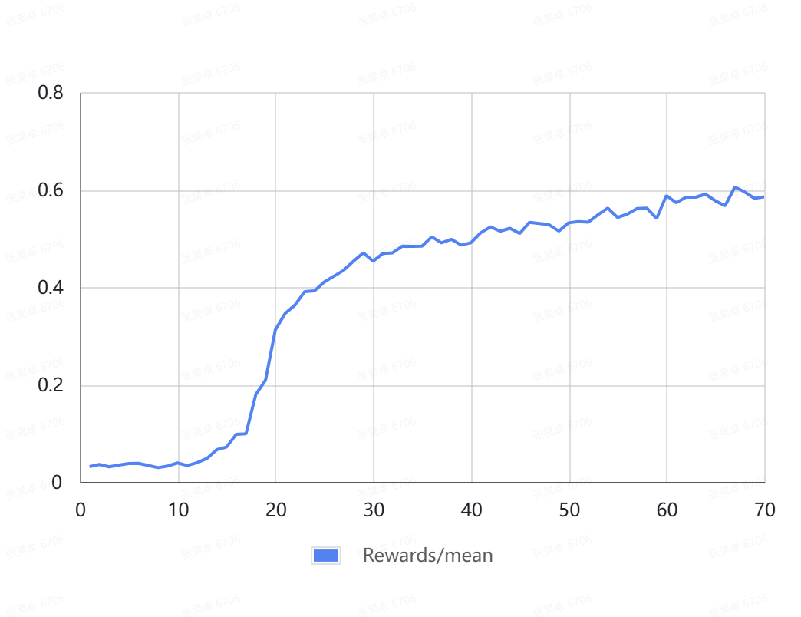
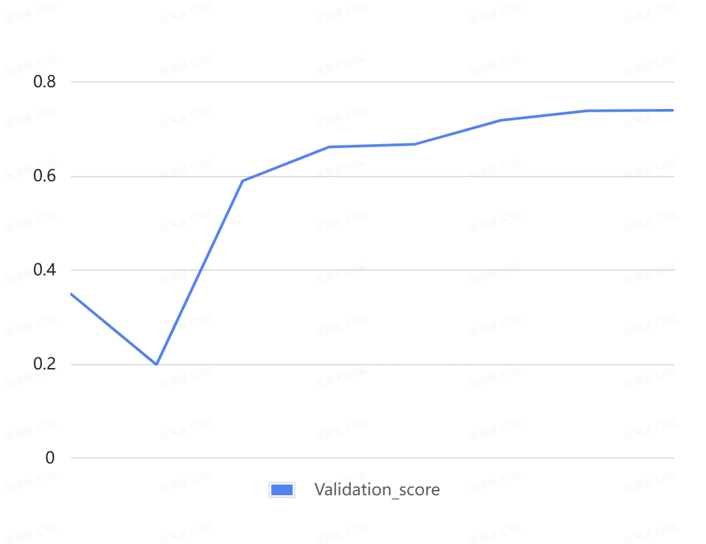

# DeepSeek-R1-Zero on Ascend NPU
This recipe provides a sample for fine-tuning the Deepseek-V3-Base model using Reinforcement Learning from Human Feedback (RLHF) on Ascend NPUs, specifically utilizing the GRPO algorithm with rule-based rewards on the deepscaler dataset.

## Implementation Details
To implement RL training for the DeepSeek model on Ascend NPUs, this example includes the following key code additions and modifications:
- We implemented a simple rule-based reward function in `deepscaler.py`, referencing `verl/utils/reward_score/gsm8k.py`.
- We provided a dataset file conversion script `json_to_parquet.py`, which adds a template to the prompts to stimulate model thinking during the data file format conversion.
- Due to potential incomplete memory offloading during sleep operations for vLLM on NPUs, we added patches to manually handle the offloading and onloading of the rollout model and KVcache on NPUs. The related code is in `vllm_rollout_spmd.py` and `megatron_workers.py`.
- To enable vLLM to utilize all ranks for expert parallelism, support for vLLM's data parallelism was necessary. For this purpose, we added patches to construct the correct data parallel communication group. The related code is in `vllm_parallel_state.py` and `vllm_rollout_spmd.py`. Additionally, the `VLLM_DP_SIZE` environment variable must be correctly set to `world_size / vllm_tp_size`.
- The MindSpeed training framework for NPUs invalidates torch.compile to avoid compilation failures during training, but this prevents its use for accelerating inference. To resolve this, we added patches that allow compilation during inference but not during training. The related code is in `megatron_workers.py`.
- During RL training, multiple KV cache scheduling operations in vLLM on NPUs could lead to inconsistent memory allocation causing memory trampling. The fix for this issue is patched in `engine_core.py`.

By searching globally for `# NPU-ADAPTATION`, you can see the actual changes made by the patch code.

For more technical details, please refer to [the Technical Report (in Chinese)](https://gitcode.com/cann/cann-recipes-train/blob/master/docs/deepseek/deepseek_rl_train_optimization.md).

## Training Details
### Hyperparameters
This example fine-tunes the DeepSeek-671B Base model on the deepscaler dataset using a combination of simple format rewards and answer accuracy rewards. The key hyperparameters are as follows:

|  iteration  | learning rate |  global batchsize  |  n_samples | temperature |  kl-coef | prompt_max_len | response_max_len | rule reward | reward model |
|:----:|:----:|:----:|:----:|:----:|:----:|:----:|:----:|:----:|:----:|
| 70 | 1e-6 (constant) |  512  |  16  |  1.0  |  0.001  |  1024  |  2048  |  format + acc  | - |

### Resource Allocation and Performance
This recipe was trained on an Ascend Atlas 800T A3 hyper-node server, utilizing 128 A3 NPUs, which is equivalent to 256 accelerator ranks. The specific deployment strategy is as follows:

| Rollout Deployment | Actor Deployment | Reference Deployment | Offload Strategy |
|:----:|:----:|:----:|:----:|
|  TP2 EP256  |  EP32 PP8  |  Same as Actor  |  Full offload, optimizer utilizes the [Mindspeed Swap Optimizer feature](https://gitee.com/ascend/MindSpeed/blob/master/docs/features/swap-optimizer.md)  |

The performance metrics for one training step are shown below (throughput varies with the model's response length during training):

|  step  | prompt_len_mean |  response_len_mean  |  timing_step (s) | throughput (tps/A3) | timing_gen (s) | timing_reward (s) | timing_old_prob (s) | timing_ref_prob (s) | timing_update (s) |
|:----:|:----:|:----:|:----:|:----:|:----:|:----:|:----:|:----:|:----:|
| 2 | 175.1 |  1385.0  |  1044.8  | 95.5 |  482.2  |  20.4  |  105.5  |  92.7  | 342.9 |

### Training Metrics
<div align="center">
  
  
  
</div>

## Quick Start

### Environment Setup
For setting up the Ascend NPU environment for verl, please refer to [ascend_quick_start.rst (in Chinese)](../../docs/ascend_tutorial/ascend_quick_start.rst).

Alternatively, you can use the provided Dockerfile to build the project's runtime environment locally: `docker build -f Dockerfile.vllm_ascend.mindspeed.deepseekV3 -t REPOSITORY:TAG ./`

Prepare the source code with the following steps:
```bash
# Clone verl
git clone https://github.com/volcengine/verl.git

# Clone and setup vLLM (v0.9.1)
git clone https://github.com/vllm-project/vllm.git
cd vllm
git checkout v0.9.1
cp -r vllm ../verl
cd ..

# Clone and setup vLLM-Ascend (commit 8c7bc45)
git clone https://github.com/vllm-project/vllm-ascend.git
cd vllm-ascend
git checkout 8c7bc45
cp -r vllm_ascend ../verl
cd ..

# Clone and setup MindSpeed (commit f6688)
git clone https://gitcode.com/Ascend/MindSpeed.git
cd MindSpeed
git checkout f6688
cp -r mindspeed ../verl
cd ..

# Install Megatron-LM.core and other dependencies
pip install git+https://github.com/NVIDIA/Megatron-LM.git@core_v0.12.1
pip install mathruler
```

### Prepare the Training Dataset
This example uses the deepscaler dataset. Prepare it as follows:
- Download the dataset [JSON file](https://huggingface.co/datasets/agentica-org/DeepScaleR-Preview-Dataset/blob/main/deepscaler.json).
- Generate the `train.parquet` and `test.parquet` files and place them in the `./data/deepscaler` directory:
    ```bash
    # Execute from the verl project directory
    python recipe/r1_ascend/json_to_parquet.py --output_dir ./data/deepscaler --json_path path/to/deepscaler.json --train_data_ratio 0.9
    ```

    The processed prompts used during training will include a specific template, for example: `A conversation between User and Assistant. The user asks a question, and the Assistant solves it. The assistant first thinks about the reasoning process in the mind and then provides the user with the answer. The reasoning process and answer are enclosed within <think> </think> and <answer> </answer> tags, respectively, i.e., <think> reasoning process here </think><answer> answer here </answer>. Put your final answer within \boxed{}. <｜User｜>{problem}<｜Assistant｜>`

### Prepare Model Weights
Prepare the DeepSeek-V3-Base model weights as follows:
- Place the model configuration files (excluding the weights) into the `./DeepSeek-V3-hf` directory. The `config.json` file needs to be replaced to remove quantization and MTP configurations. Refer to [this link (in Chinese)](https://gitcode.com/cann/cann-recipes-train/blob/master/rl_train/deepseek/README.md#%E6%A8%A1%E5%9E%8B%E6%9D%83%E9%87%8D%E5%87%86%E5%A4%87) for details.
- Download the FP8 model weights from [HuggingFace](https://huggingface.co/deepseek-ai/DeepSeek-V3-Base) or [ModelScope](https://www.modelscope.cn/models/deepseek-ai/DeepSeek-V3-Base). Ensure the target disk has over 650GB of free space.
- Convert the FP8 weights to BF16 weights. Refer to [this link (in Chinese)](https://gitcode.com/cann/cann-recipes-train/blob/master/rl_train/deepseek/README.md#%E6%A8%A1%E5%9E%8B%E6%9D%83%E9%87%8D%E5%87%86%E5%A4%87) for instructions. This step requires over 1300GB of free space on the target disk.

This example uses pre-sharded distributed weights. Therefore, the following weight sharding step is also required:
- The distributed weights will be stored in `ckpts/DeepseekV3-dist-ckpts`.
- Use the script `verl/scripts/converter_hf_to_mcore.py` to shard the original BF16 weights into distributed weights. In practice, we found that 2TB of CPU RAM was insufficient for sharding the 671B model. Therefore, we adapted this script for expert parallelism and performed the weight sharding using a distributed strategy of EP8 PP8 across 64 NPUs.

### Other Code Modifications
In practice, to achieve the above results for on-policy RL training, we need to replace the `old_log_prob = data["old_log_probs"]` code in `verl/workers/actor/megatron_actor.py` with:

```python
on_policy = self.config.ppo_epochs == 1
if on_policy:
    old_log_prob = log_prob.detach()    # guarantee exact numerical equality
else:
    old_log_prob = data["old_log_probs"]
```

### Execute RL Fine-tuning
```bash
# Start the RL fine-tuning for DeepSeekV3 from the verl directory
bash ./recipe/r1_ascend/ray_start_grpo_npu.sh
```
